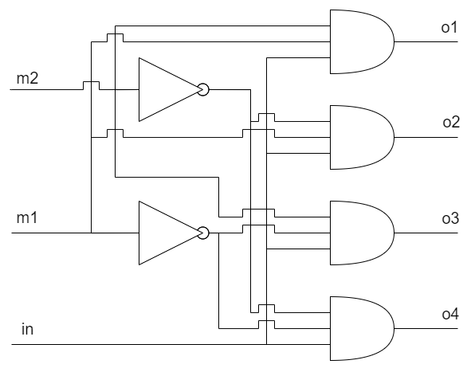
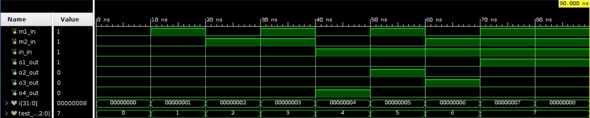

<h2 align=center>Лабораторная работа 1</a> </h2>

#### Вариант 1

Демультиплексор "1 в 4"

#### Цели работы

Получить навыки описания схем базовых операционных элементов (БОЭ) комбинационного типа на вентильном уровне с использованием языка описания
аппаратуры Verilog HDL.

#### Выполнение 
**Таблица истинности** 
| m1 | m2 | in | o1 | o2 | o3 | o4 |
| :--: | :--: | :--: | :--: | :--: | :--: | :--: |
| 0 | 0 | 0 | 0 | 0 | 0 | 0 |
| 0 | 0 | 1 | 0 | 0 | 0 | 1 |
| 0 | 1 | 0 | 0 | 0 | 0 | 0 |
| 0 | 1 | 1 | 0 | 0 | 1 | 0 |
| 1 | 0 | 0 | 0 | 0 | 0 | 0 |
| 1 | 0 | 1 | 0 | 1 | 0 | 0 |
| 1 | 1 | 0 | 0 | 0 | 0 | 0 |
| 1 | 1 | 1 | 1 | 0 | 0 | 0 |

**Схема демультиплексора**

**Временная диаграмма**

#### Вывод

В результате выполнения данной лабораторной работы нами был реализован демультиплексор "1 в 4" с использованием языка описания
аппаратуры Verilog HDL.
