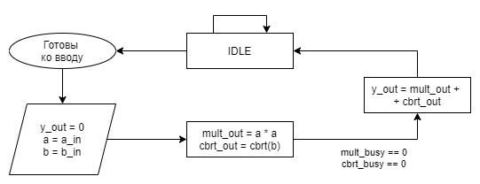
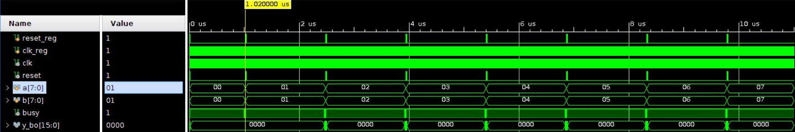
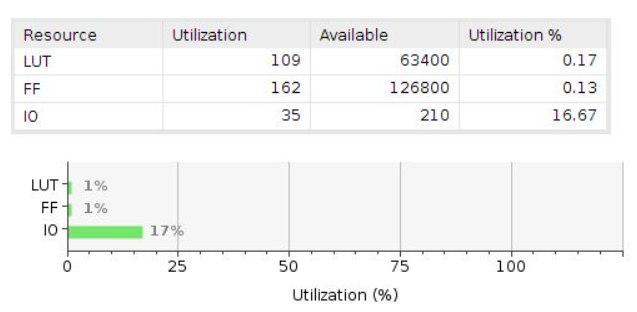
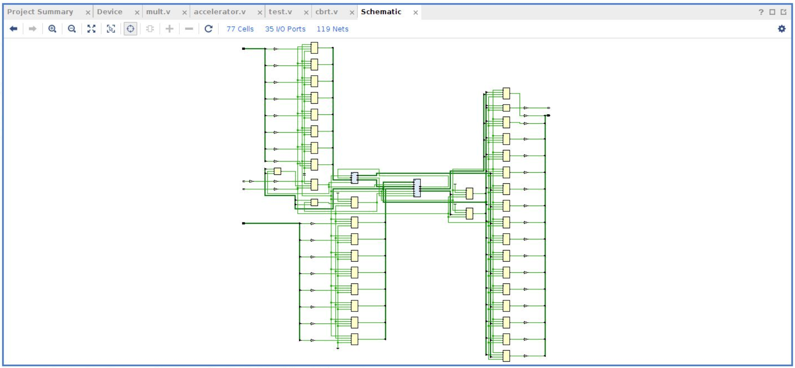

<h2 align=center>Лабораторная работа 2</a> </h2>

#### Вариант 1

Формула: `a^2 + b^(1/3)`
2 умножителя и 1 сумматор

#### Цели работы

- Разработайте и опишите на Verilog HDL схему, вычисляющую значение функции в соответствии с заданными ограничениями согласно варианту задания.
- Определите область допустимых значений функции.
- Разработайте тестовое окружение для разработанной схемы. Тестовое окружение должно проверять работу схемы не менее, чем на 10 различных тестовых векторах.
- Проведите моделирование работы схемы и определите время вычисления результата. Схема должна тактироваться от сигнала с частотой 100 МГц.

#### Выполнение 

##### Конечный автомат для алгоритма вычисления функции



Локальные данные:

* a -- 8 бит \[7 : 0\]
* b -- 8 бит \[7 : 0\]

чтобы не заставлять пользователя держать сигнал на a_in и b_in

##### Описание работы алгоритма

1. Бинарный поиск кубического корня из `b`. Т.к. 0 &leq; `b` &leq; 255, то 0 &leq; `b ^ (1/3)` < 7.
   Следовательно, мы гарантированно не ошибемся, если будем искать от 0 до 7 включительно
2. Возведение `a` в квадрат
3. Сложение двух полученных результатов

##### Описание модуля на языке Verilog HDL


##### Тестовое окружение


##### Описание окружения и результаты тестирования

Тестировать будем так - каждый такт нашего генератора будем проверять не освободился ли вычислительный модуль, если нет, то ждем дальше, если он свободен, то подаем на вход новые значения. Результаты тестирования представлены ниже.
```
    0^2 + floor cbrt   0 =    0
    1^2 + floor cbrt   1 =    2
    2^2 + floor cbrt   2 =    5
    3^2 + floor cbrt   3 =   10
    4^2 + floor cbrt   4 =   17
    5^2 + floor cbrt   5 =   26
    ...
```

##### Временная диаграмма

Ниже представлена временная диаграмма для тестов.



##### Потребление ресурсов на FPGA

Замеры потребления ресурсов FPGA были сделаны в симуляторе Vivado.



##### Схема устройства



#### Вывод

В ходе выполнения работы была создана последовательностная схема ускорителя математических вычислений.
