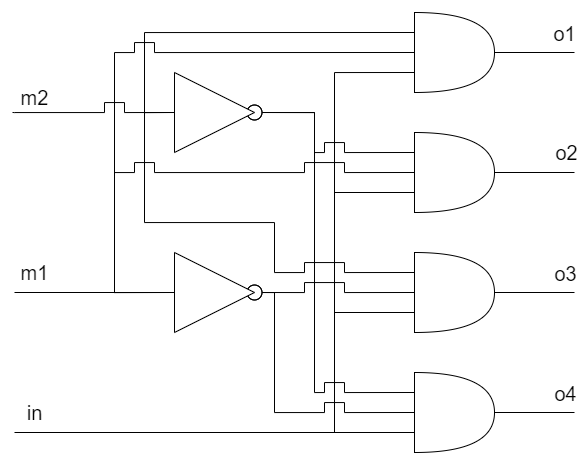
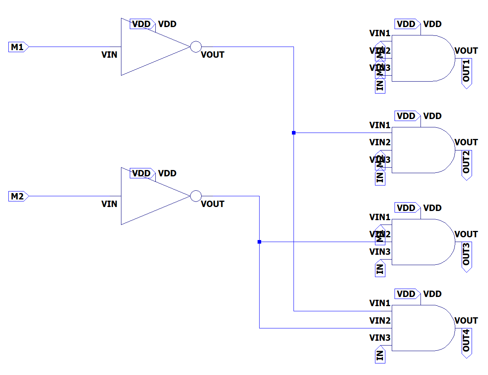
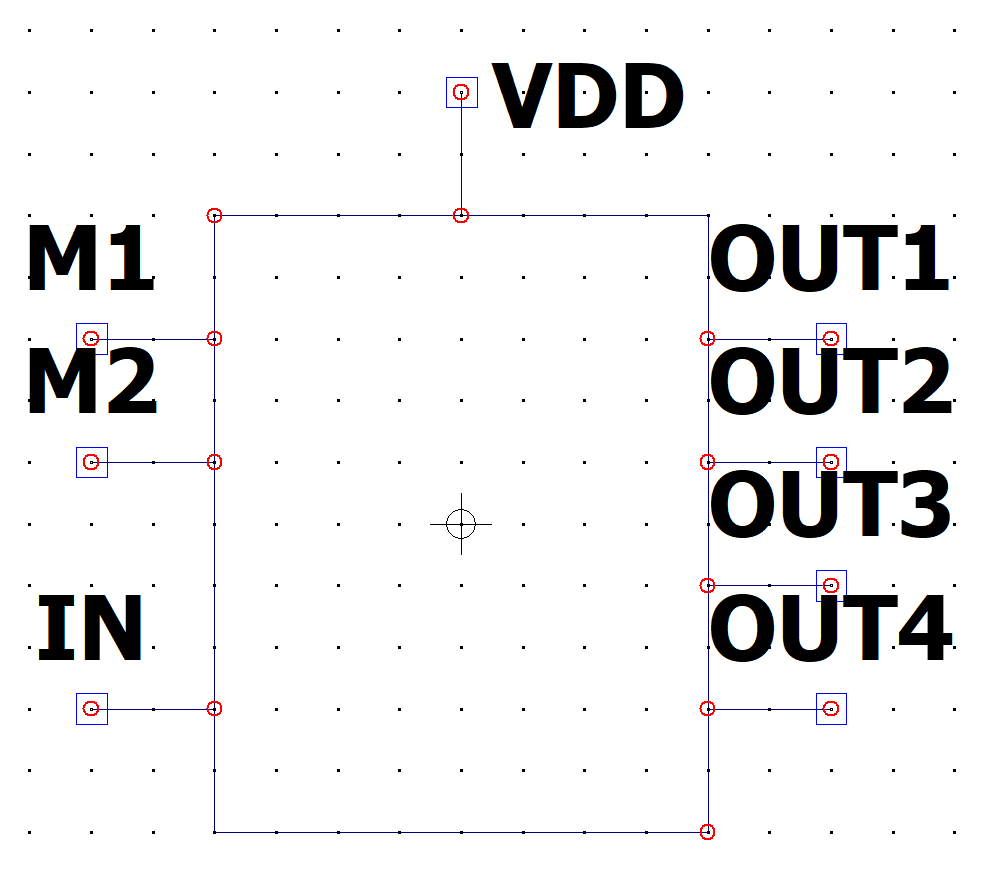
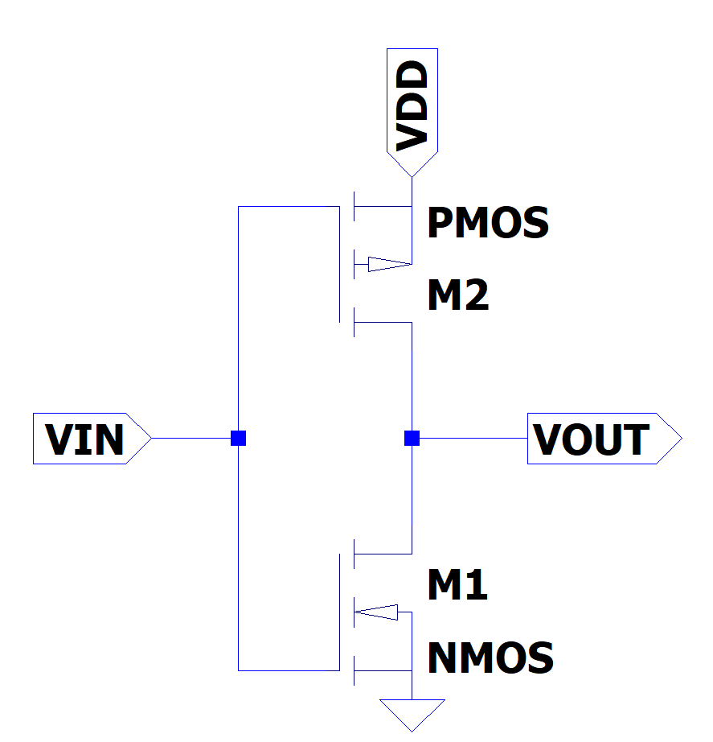
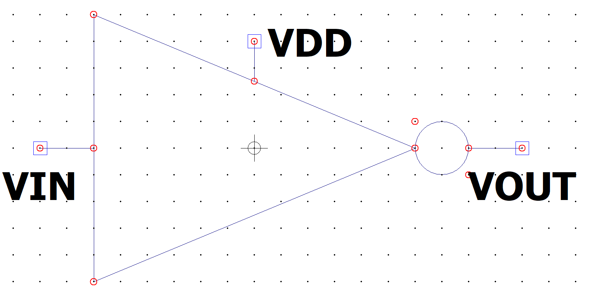
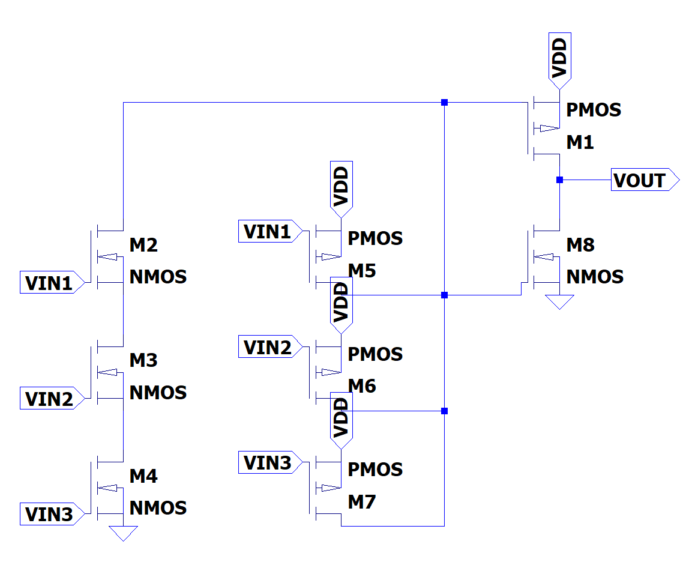
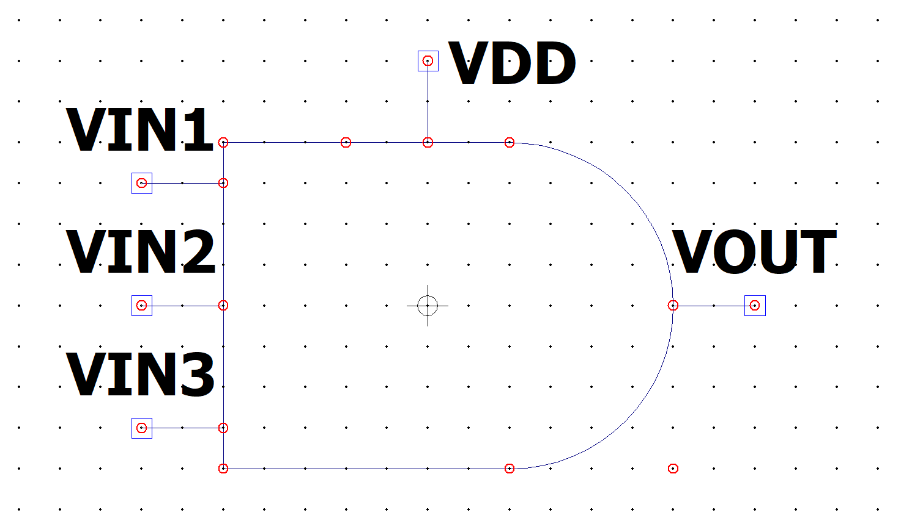
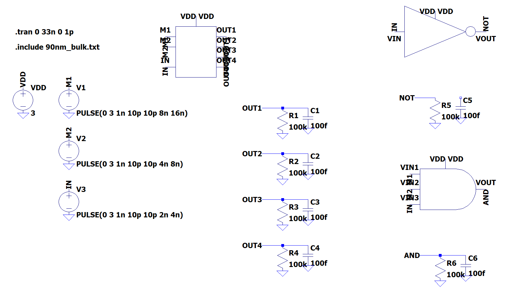
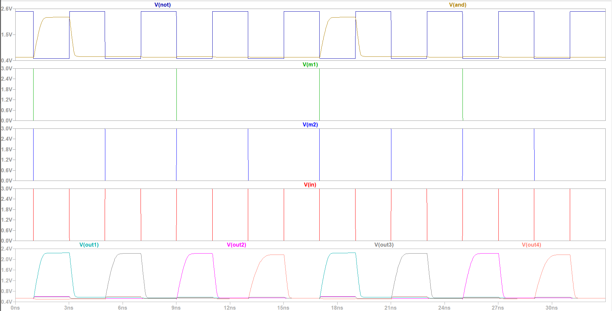

<h2 align=center>Лабораторная работа 4</a> </h2>

#### Вариант 1

Демультиплексор "1 в 4"

#### Задание

1. Постройте в LTspice на транзисторах схему вентиля, составляющего основу логического базиса согласно варианту задания.
2. Создайте символ для разработанного вентиля как иерархического элемента.
3. С использованием созданного иерархического элемента постройте схему тестирования вентиля.
4. Проведите моделирование работы схемы и определите задержку распространения сигнала через тестируемый вентиль.
5. Определите максимальную частоту изменения входных сигналов, при которой
построенная схема сохраняет работоспособность.
6. Постройте БОЭ на базе созданного вентиля согласно варианту задания.
7. Создайте символ для построенного БОЭ.
8. Проведите моделирование работы схемы и определите задержку распространения сигнала через БОЭ.

#### Выполнение 

**Схема демультиплексора**

**Реализованная схема демультиплексора**

**Инвертор**

**AND на 3 входа**

**Тестовый стенд**

**Временная диаграмма**

#### Вывод

В ходе выполнения работы мы познакомились с системой LTspice и создали демультиплексор с использованием транзисторов.
